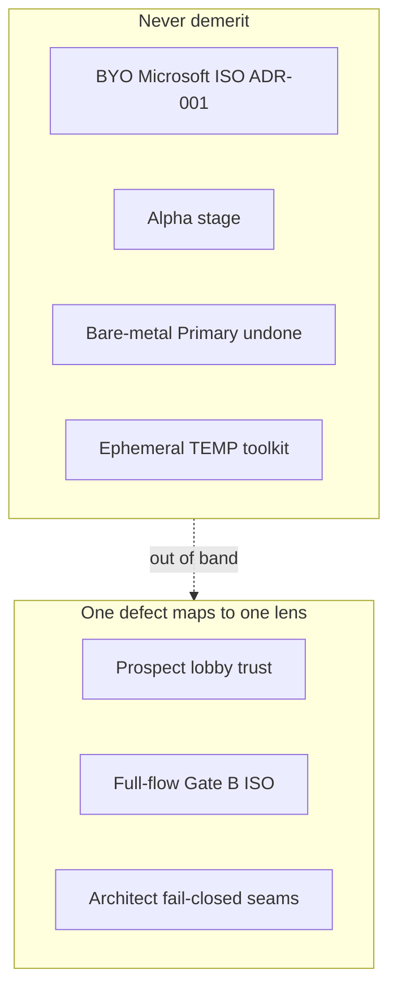

# WinMint score rubric — host-operator (ephemeral by design)

**Status:** locked for Prospect / Full-flow / Architect reviews  
**Date:** 2026-08-11 (methodology revision)  
**Supersedes:** durable-install instincts; any “default `-CacheRelease` to hit 9” advice; prior band table that blocked 10 on Alpha / bare-metal (those are out of band below).

## What this card measures

Three **independent** host-operator lenses. WinMint is scored **at Alpha**, as a **session-shaped** toolkit that builds offline ISOs. It is **not** scored as a finished Primary wipe product.

## Never demerit (locked)

Do **not** lower any lens for:

| Item | Why |
|------|-----|
| BYO official Microsoft Source ISO | Legal invariant ([ADR-001](../../decisions/ADR-001-source-iso-legal.md)) |
| Alpha / no “Primary-proven” Status | Stage context; Gate B ≠ completed install is honesty, not a gap |
| Bare-metal wipe / WinPE → OOBE → FirstLogon undone | Out of band for this card |
| Ephemeral TEMP toolkit delete on Wizard exit | Product identity |
| Optional durable cache (`-CacheRelease`) not default | Opt-in by design |
| .NET 11 preview used to **build** release zips | Host toolchain |
| External Rufus **DD** flash (named, honest) | Operator step |
| Multi-hour DISM when wait honesty is clear | Physics of offline servicing |

## Do demerit (by lens — no double-count)

Assign each defect to **exactly one** primary lens. If two lenses seem to apply, use the table below.

| Defect class | Primary lens |
|--------------|--------------|
| Broken / unverified `irm`, clone-as-Quickstart, missing lobby honesty, no first win without ISO | **Prospect** |
| Cannot reach flashable Gate B `out.iso` from live session or one disposable re-fetch; workdir deleted with toolkit; soft metal sold as wipe; weak Rufus/SHA/wait guidance | **Full-flow** |
| Soft Release greens Primary flash path; missing release `.sha256`; assert trusts lane without `packageStrict`; Index/digest/LaunchApply footguns; Gate B claimed as completed install | **Architect** |

Deploy lag: when claiming scores for **live** `winmint.yanai.sh`, score the **deployed** Worker + release assets. Local-tree-only improvements do not raise live Prospect/Full-flow until deployed (note “local 9 / live 8” if needed).

---

## Lenses (non-overlapping)

### Prospect — visitor / tryability (1–10)

**Job:** Would a curious ARM64 Windows developer **try** the lobby and trust what they see in ~five minutes?

**In scope:** One-liner reachability; SHA-256 integrity story; Alpha + ADR-001 honesty; ephemeral contract explained; first win **without** Source ISO (`ValidateOnly` / `just plan`); no clone/source-zip as hero path.

**Out of scope:** Whether wipe ISO build is elegant; package-strict evidence; DISM duration; Rufus steps (those are Full-flow / Architect).

| Score | Meaning |
|------:|---------|
| 7 | Lobby works but continuity docs fight ephemeral intent, or Quickstart still smells like clone |
| 8 | Ephemeral try works; small friction (awkward validate invocation, undeployed docs vs live) |
| 9 | Safe valuable one-liner; legal/alpha/ephemeral clear; first win without ISO; live Worker matches promised routes |
| 10 | Same as 9 with almost no lab caveats — peer-recommend the **try** path (not “wipe proven”) |

**Mandatory evidence (or score ≤7):**

1. Cold `irm https://winmint.yanai.sh` returns bootstrap (or document local-only).  
2. Release zip install path refuses missing `.sha256` (contract or cold).  
3. README Quickstart is no-clone; BYO ISO + Alpha stated.  
4. A no-ISO first win is documented and runnable (`ValidateOnly` or `just plan` from session).

### Full-flow — host path to flashable Gate B ISO (1–10)

**Job:** From a **live ephemeral session** and/or **one disposable re-fetch**, can an operator produce Gate B wipe media (`Release` + package-strict) with honest wait/flash guidance?

**In scope:** Wizard Release → Build **or** `/primary-gate` **or** `just primary-gate`; Gate B workdir outside TEMP toolkit; `watch-apply` aligned; Rufus DD + `digests.outputIso.sha256`; `metal` ≠ Primary; wait honesty (no STALL lies).

**Out of scope:** Lobby polish; checksum of the GitHub release zip (Architect/Prospect); guest FirstLogon (never-demerit).

| Score | Meaning |
|------:|---------|
| 7 | Recipes exist but continuity broken (workdir dies with toolkit; docs require durable after quit) |
| 8 | Wipe path works but awkward handoffs (scriptblock tax, second-terminal-only, wrong watch default) |
| 9 | Live session **or** plain one-shot reaches Gate B `out.iso`; workdir survives; flash/SHA/wait honest |
| 10 | Near one-command / in-Wizard chain with minimal handoffs — still not bare-metal proven |

**Mandatory evidence (or score ≤7):**

1. Documented Gate B entrypoints agree on workdir `%LOCALAPPDATA%\WinMint\work\sl7-primary`.  
2. Soft `metal QUALITY=Release` cannot be the wipe story.  
3. Flash = Rufus DD + SHA vs evidence digests.  
4. At least one path needs no standing LocalAppData **toolkit** install.

### Architect — orchestration trust (1–10)

**Job:** Would you trust the **host pipeline seams** (plan → apply → evidence → assert → flash honesty) without inventing a new framework?

**In scope:** Mandatory release `.sha256`; Gate B = Release + package-strict; evidence stamps `packageStrict`; assert fail-closes soft Release under `-RequireLane Release`; single-image / LaunchApply Index:1; digest freshness; Status honesty (Gate B ≠ Primary wipe).

**Out of scope:** README copy polish; Wizard UX; whether `/primary-gate` is deployed; bare-metal outcomes.

| Score | Meaning |
|------:|---------|
| 7 | Seams OK; flash footguns remain |
| 8 | Strong integrity; minor soft edges (e.g. Cli soft Release warn-only — **accepted by design**) |
| 9 | Gate B fail-closed end-to-end on host evidence; mandatory checksums; no Primary-as-proven lie |
| 10 | Little left to distrust on the **host** path under never-demerit constraints |

**Mandatory evidence (or score ≤7):**

1. Bootstrap refuses install without checksum asset.  
2. Metal refuses Release without `-PackageStrict`; flash copy only on Gate B.  
3. `evidence.json` can carry `packageStrict`; Release assert requires it true.  
4. Docs/Status do not claim Primary wipe from Gate B alone.

**Accepted soft edge (do not demerit Architect for this alone):** Cli `Release` without `--package-strict` remains **warn-only** for maintainer compression builds. Gate B surfaces are metal / Wizard Release / `/primary-gate` / `primary-gate`.

---

## Anti-patterns for reviewers

- Demeriting BYO ISO, Alpha, ephemeral default, or undone bare-metal  
- Requiring durable toolkit cache for a 9  
- Scoring bare-metal / FirstLogon into Full-flow or Architect  
- Double-counting one defect across two lenses  
- Rubber-stamping prior 9/9/9 self-scores  
- Scoring local tree as live Prospect when Worker/release not deployed  
- Blocking **10** solely because Primary wipe is unproven (that factor is never-demerit; 10 means best under this card)

## How to run a review

1. Read this file first.  
2. Read root README + Justfile `primary-gate` / `metal` / `watch-apply` + `winmint.ps1` + Worker routes if scoring live.  
3. Run the **mandatory evidence** checklist per lens (fail closed to ≤7 if skipped).  
4. Deliver three integers (Architect may use .5): Score, what earned it under **this** card, remaining gaps **under 9 for that lens only**, one line: durable-default advice still applies? (usually: no).
