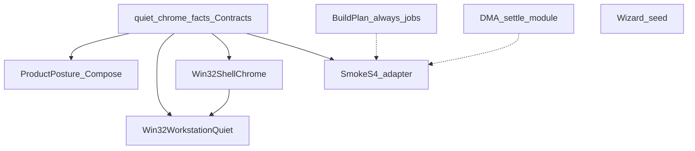

# Deepening research — quiet cluster, DMA settle, Wizard seed

**Date:** 2026-10-07  
**Kind:** research brief (not an implementation plan)  
**Inputs:** architecture review (quiet-posture, DMA settle, shell.chrome, always-on jobs, Wizard seed)  
**Method:** read-only map + design-it-twice scoring; no product code in this phase

Vocabulary: **module**, **interface**, **implementation**, **depth**, **seam**, **adapter**, **leverage**, **locality** (codebase-design). Domain names from `CONTEXT.md`.

---

## Dependency graph

- Quiet/chrome **facts** unlock honest Smoke locality and remove the ProductPosture ↔ Win32WorkstationQuiet sync test as the seam.
- **shell.chrome apply** deepen depends on facts only for tagging live-only taskbar keys; ordering deepen can follow facts or proceed in parallel if the subset set is already named.
- **Always-on jobs** are weakly coupled: PlanDiff/`RequiredPhases` re-list kinds; do not block facts or DMA.
- **DMA settle** is independent of the quiet cluster (Smoke only shares acceptance *document* space).
- **Wizard seed** is independent; research says skip the fold.

---

## Track 1 — Quiet cluster

### Current map

| Concern | Owner today | Notes |
|---|---|---|
| ExplorerAdvanced DWord map | Duplicated: `ProductPosture.DefaultUserExplorerAdvanced` + `Win32WorkstationQuiet.ExplorerAdvancedDwords` | Sync enforced by `ProductPostureTests.ComposeDefaultUserRows_matches_quiet_overlay…` |
| Offline skip / live deferral of taskbar keys | Two HashSets (`DefaultUserOfflineSkip…` vs `TaskbarChromeExplorerAdvanced`) | Same four names; comments admit dual ownership |
| CDM names | Duplicated arrays | Same sync test |
| Bloom / Start pins / taskbar OEM XML | `GuestChrome` (Contracts) — **already shared** | ProductPosture + ShellChromeLayout consume |
| Live quiet Apply | `Win32WorkstationQuiet.Apply` | Theme + non-taskbar Advanced + CDM |
| Live taskbar chrome DWords + Spotlight | `Win32WorkstationQuiet.ApplyTaskbarChrome` called from `Win32ShellChrome.Apply` | Phase: after packages |
| ShellSurfaces | Pass-through to `IGuestMachine.ApplyShellChrome` + desktop request glue | Fails deletion test as chrome module |
| Always-on FirstLogon jobs | Inline in `BuildPlan.Plan` | `onedrive` / `reservedStorage` / `workstation.quiet` / `shell.chrome`; conditionals for DoH, safetyNet, desktop |
| PlanDiff always label | `PlanDiff.JobAlways` | Re-lists kinds |
| Smoke S4 quiet/chrome facts | `SmokeS4AcceptanceFacts.ps1` | Restates wallpaper, Spotlight, quiet DWords, pin *ids*, DevMode/Sudo/LongPaths; Assert consumes |

Project refs: Orchestrator → Contracts; Provisioning → Contracts; neither assembly references the other. **Facts cannot live only in Orchestrator without continued duplication or an illegal upward dependency.**

### Design-it-twice (seam home for always-on quiet/chrome facts)

#### Alt A — Facts in Contracts (extend `GuestChrome` or sibling module)

- **Interface sketch:** phase-tagged tables (offline-stamp vs live-quiet vs live-chrome) + pin/wallpaper constants already in `GuestChrome`.
- **Callers:** `ProductPosture.Compose*` reads offline rows; `Win32WorkstationQuiet` / chrome read live subsets; Smoke stays an **adapter** (see below).
- **Depth:** one module owns product-constant registry/path facts; Compose/Apply stay thin adapters of phase.
- **Locality:** DWord drift fixes once.
- **Leverage:** Plan stamp + FirstLogon + harness.
- **ADR:** Strengthens ADR-009; keeps ADR-015 axes separate; CDM remains product-constant (ADR-007).
- **Smoke:** PS cannot reference Contracts. Prefer a **contract/unit sync test** that dotsources `SmokeS4AcceptanceFacts.ps1` and asserts equality against Contracts constants (same pattern as ProductPostureTests ↔ Win32Quiet today, but one C# source). Optional later: `just check` emits JSON from a tiny C# probe — only if PS↔Contracts sync tests get painful. Do **not** pull Hyper-V into C#.

#### Alt B — Facts in Orchestrator `ProductPosture`

- Provisioning cannot see ProductPosture without a new project reference (Orchestrator-sized dependency into guest AOT — rejected).
- Remaining option: generated export / dual tables — **same shallow split**, stronger sync only.
- **Score:** fails locality for FirstLogon; fails deletion test as a *shared* module.

#### Alt C — Leave facts split; only delete `ShellSurfaces` + compose always-jobs

- Small wins; dual ExplorerAdvanced maps remain the bug class.
- **Score:** incomplete for the architecture-review Strong card.

### Recommendation (quiet facts)

**Alt A.** Put quiet/chrome acceptance data in Contracts (extend `GuestChrome` or a sibling static module next to it). Tag:

- offline-safe ExplorerAdvanced / CDM / theme rows  
- live-only taskbar Advanced subset (today’s four keys)  
- Spotlight / bloom / pin baselines (already partly in `GuestChrome`)  
- machine posture Smoke mirrors already stamped by ProductPosture (`AppModelUnlock` / Sudo / LongPaths) — expose the expected values next to those Compose rows or as Contracts constants Smoke syncs against

ProductPosture and Win32WorkstationQuiet become **consumers**. Delete private duplicate dictionaries.

### Sub-pieces — deepen / skip / defer

| Sub-piece | Verdict | Approach |
|---|---|---|
| Quiet/chrome fact tables | **Deepen** | Contracts home (Alt A) |
| Smoke S4 quiet/pin/wallpaper facts | **Deepen** (adapter) | Thin PS + sync test against Contracts; do not keep PS as authoritative |
| `ShellSurfaces.TryApplyChrome` | **Delete** (shallow) | JobRunner → `guest.ApplyShellChrome` / request directly; keep `ApplyDesktopAsync` as optional thin helper or inline (ADR-015 naming can live on `ShellDesktop`) |
| shell.chrome Apply ordering | **Deepen** (after or with facts) | Own Spotlight → wallpaper → pins → taskbar DWords → Taskband → verify behind one chrome-apply module; replace source-grep tests with fake FS/registry **internal** seam or keep Smoke as sole Win32 proof but stop treating Layout unit tests as Apply proof |
| Always-on `ProvisionJob` list | **Defer / light** | Keep assembly in BuildPlan (needs package slice + conditionals). Extract **always-on kind set** shared by `PlanDiff.JobAlways` (and optionally Smoke phase names that map 1:1). Do **not** force ProductPosture to return full ordered jobs including DoH/desktop |
| Merge chrome + desktop jobs | **Skip** | Contradicts ADR-015 |

### Rejected (quiet cluster)

- Orchestrator-only fact home (Alt B).
- “Sync tests forever” as the product seam (Alt C as destination).
- Generating facts from Smoke into C# (wrong polarity).
- Flattening ADR-015 axes into one shell job.

---

## Track 2 — DMA settle

### Current map

| Concern | Owner |
|---|---|
| Poll loop / budgets / wall | `ProvisioningSession.RunSettleAsync` |
| One-probe fail-open | `DmaSettleConfidence.TryPollProbe` |
| Hard predicates / latch policy | `DmaSettleConfidence` |
| Full vs resume pipelines | Session (`RunSettleAsync` vs `ReverifySettleHardFieldsOnResume`) — **shared latch+restore tail, duplicated hard-gate** |
| Visible region I/O | `Win32RegionSnapshot` → `IRegionSnapshot` |
| DeviceRegion latch I/O | `Win32DmaSetupRegion` → `IDmaSetupRegion` |
| Evidence / splash / job gating | Session |

`DmaSettleConfidence` is a **shallow predicate/latch helper**; Session still owns the settle **module** role (orchestration). Tests: mostly `RunShellAsync` scripts; latch policy unit-tested; resume covered in checkpoint tests; restore-after-latch not isolated.

### Design-it-twice

| Design | Depth / locality / leverage | Score |
|---|---|---|
| **D1** One settle module: ports + policy + budgets → outcome; resume = no-poll mode | Highest — kills pipeline twin + hard-gate triple; ADR-003 order in one place | **Recommend** |
| **D2** Move only latch/restore into Confidence; Session keeps poll | Partial — twin pipelines remain | Incremental only |
| **D3** Richer Outcome type alone | Cosmetic without D1 | Weak alone |

### Recommendation (DMA)

**D1.** Deepen a settle module over existing ports (`IRegionSnapshot`, `IDmaSetupRegion?`). Modes: Full (Apply + poll → hard-gate → latch → restore → soft location warn) vs Resume (single authoritative Read → hard-gate → latch → restore). Session shrinks to: choose mode, supply budgets/wall/cancel/target, `Note` statuses, branch on hard-fail/timeout.

**Keep as adapters:** Win32 region + DeviceRegion.  
**Keep on Session:** tenure/splash/evidence/fail-open, when to call settle.  
**MachineSetup:** share latch ensure + Unauthorized polarity; do not force Shell outcome type onto SetupComplete exit path.

**ADR-003 bars preserved:** Ireland DeviceRegion latch ≠ visible Geo; final snapshot authoritative; MachineSetup soft Unauthorized vs Shell fail-closed; no guest pwsh control plane (inbox `powershell.exe` Set-Culture stays inside region adapter — ADR-004).

### Rejected (DMA)

- Collapsing visible + latch into one port.
- Making intermediate probe failures authoritative.
- D2/D3 as final destinations.
- Absorbing Host `HostDmaSettle` (compose-time) into guest settle module.

---

## Track 3 — Wizard seed (light)

### Deletion tests

| Target | Verdict |
|---|---|
| `PackageChips` (3 consts) | Complexity **vanishes** if inlined into `ChipAxisResolve` |
| `ChipAxisResolve` | Complexity **reappears** — needed for post-seed Wizard refine/compile (YASB / Komorebi / chips), not only Station seed |
| Fold both into `StationOutcomes.TrySeed` | **No-go** — seed ≠ refine; would fight ADR-015 post-seed axes or merely rename the second API |

### Recommendation

**Skip** the StationOutcomes fold. Optional tiny cleanup later: inline `PackageChips` into `ChipAxisResolve` and delete the 9-line file — not part of the deepening sequence. ADR-016 (no Lane) is orthogonal.

---

## Per-candidate scoreboard

| Candidate (architecture review) | Decision | Recommended approach |
|---|---|---|
| One quiet-posture table | **Deepen** | Contracts facts module; Compose + Apply + Smoke sync consume |
| DMA settle one deep module | **Deepen** | D1 settle module; resume = no-poll mode |
| Deepen shell.chrome; drop ShellSurfaces | **Deepen** (ordered after facts tagging) | Delete ShellSurfaces pass-through; chrome-apply owns ordering |
| Always-on FirstLogon jobs into ProductPosture | **Defer / light** | Share always-on **kind set** with PlanDiff; keep job assembly in BuildPlan |
| Collapse Wizard seed stack | **Skip** | Optional PackageChips inline only |

**ADR reopen:** none. Deepen under ADR-009, ADR-003, ADR-015, ADR-004, ADR-014 (choices in this brief; facts in code).

**Parked (out of scope):** slim `IGuestMachine`; AppX safety-net narrow; `HostReviewFactory` inline — revisit only if quiet/chrome deepenings force the bag to grow.

---

## Suggested later implementation order

For a future writing-plans / implement session (not this research):

1. **Contracts quiet/chrome facts** + rewire ProductPosture + Win32WorkstationQuiet; extend sync tests; thin SmokeS4 toward Contracts (sync assert).
2. **DMA settle D1** (independent — can parallel with 1 if staffing allows).
3. **shell.chrome apply deepen** + delete `ShellSurfaces` chrome pass-through; keep desktop path under ADR-015.
4. **Always-on kind set** shared with PlanDiff (and Smoke phases only where 1:1); skip Wizard fold.

Success of *this* research: the questions in the research plan are answered above without shipping product code.
